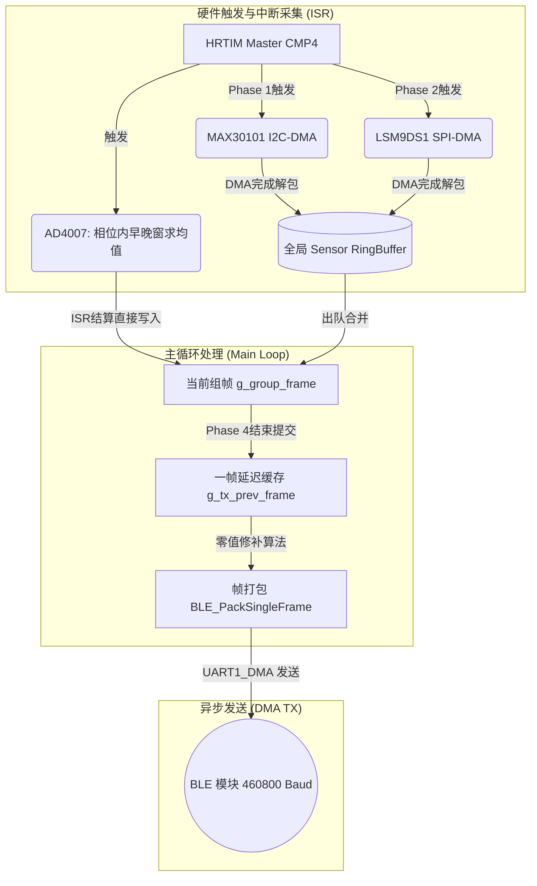
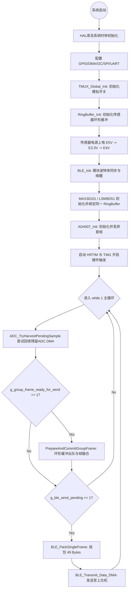
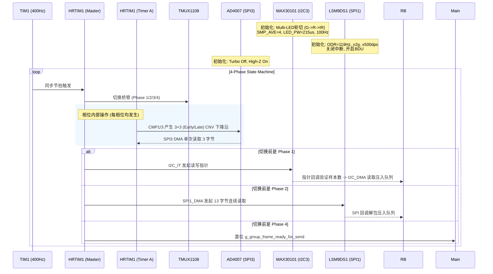

# PulseTIMR2 - 高精度多传感器同步采集系统

PulseTIMR2 是基于 **STM32G474** 微控制器开发的高频多传感器同步采集与无线传输系统。项目利用高级定时器（HRTIM）的皮秒级特性驱动模拟开关（TMUX1108）与高速 ADC（AD4007），同时基于无阻塞异步状态机同步采集 PPG（MAX30101）和六轴 IMU（LSM9DS1）数据，并通过 BLE 模块以 DMA 方式全速透传至上位机。

---

## 📑 目录

1. 整个数据的采集-入队-发送流程
2. 项目整体初始化与主循环流程
3. 定时器-传感器通信与参数配置流程
4. 关键数据结构与核心函数
5. 通信协议帧结构

---

## 1. 整个数据的采集-入队-发送流程

系统的数据流采用了 **“中断生产者 -> 环形缓冲区 (RingBuffer) -> 主循环消费者 -> DMA发送”** 的非阻塞管线架构，极大程度避免了高频采样时的数据积压与线程竞争。



---

## 2. 项目整体初始化与主循环流程

系统在启动时严格控制了外设的上电时序和初始化顺序，进入主循环后保持极简设计，仅负责帧拼接与异步发送。

### 2.1 整体流程图



### 2.2 流程说明
1. **上电时序控制**：确保 GPIO 控制的传感器电源（PE7/PE8/PE10）按顺序稳定建立。
2. **传感器异步绑定**：将 `MAX30101` 和 `LSM9DS1` 的数据目标指针挂载到全局 `g_sensor_rb` 环形缓冲，使驱动层与业务层完全解耦。
3. **极简主循环**：主循环被设计为“纯消费者”，依赖 `g_group_frame_ready_for_send` 标志位由 HRTIM 中断驱动。组帧时执行**1帧延迟策略**，当当前帧 PPG 偶尔丢包时，利用相邻历史帧计算均值进行平滑修补。

---

## 3. 定时器-传感器通信与参数配置流程

该项目核心突破在于使用 **TIM1 级联 HRTIM1 构造的微秒级 4 相位状态机**，确保了 ADC 高速采集与低速 PPG/IMU 采集的节拍完全对齐。

### 3.1 传感器参数与时序工作流



### 3.2 传感器配置参数提炼
* **MAX30101 (PPG)**: 
  * 工作模式：`MULTI_LED_MODE`（时隙为 Green -> Red -> IR）。
  * 核心指标：SPO2 SR=800sps 结合 8x 平均（等效100Hz），LED 脉宽 `215us`（17位分辨率）。
  * 读策略：中断非阻塞触发 (`TriggerPointerRead_IT`) -> 判断 `(WR+32-RD)%32` 算得可用样本 -> DMA 直接抽取 FIFO 压入 `RingBuffer`。
* **LSM9DS1 (IMU)**: 
  * 工作模式：关闭 FIFO 与硬件 DRDY 中断，开启 `BDU`（区块数据更新）和地址自增。
  * 核心指标：ODR=`119Hz`，加速度 `±2g`，角速度 `±500dps`。
  * 读策略：在 Phase 2 通过 SPI1 DMA 发送 1 字节命令读取 12 字节六轴数据。
* **AD4007 (ADC)**: 
  * 核心指标：18-bit，SPI CPOL=0/CPHA=1，SPI 时钟极高分频 (`DIV4`)。
  * 读策略：每次产生 CNV 下降沿后触发 SPI3 RxTx DMA，`AD4007_DecodeOneSample` 提取低 18 位并做符号位扩展 (`int32_t`)。

---

## 4. 关键数据结构与核心函数

项目对数据流内存做了精心设计，避免 ISR 与主循环争抢资源。

### 4.1 核心数据结构

**1. 传感器数据融合帧 (`SensorDataFrame_t`)**
承载大周期一帧的完整快照，包含四个相位的早期/晚期 ADC 均值及辅助传感器数据。
```c
typedef struct {
    /* 4 个相位的 ADC early 与 late 采样均值 */
    struct {
        int32_t early_code;
        int32_t late_code;
    } adc_data[4];

    /* PPG 三路光数据：Green, Red, IR */
    uint32_t ppg_data[3];

    /* IMU 六轴原始数据：Gx, Gy, Gz, Ax, Ay, Az */
    int16_t imu_data[6];
} SensorDataFrame_t;
```

**2. 线程安全环形缓冲区 (`SensorRingBuffer_t`)**
专为中断生产者和主循环消费者打造。当满载时主动丢弃老数据，保证实时性 (`next_tail` 推进)。
```c
typedef struct {
    SensorDataFrame_t buffer[RING_BUFFER_SIZE];
    volatile uint16_t head;
    volatile uint16_t tail;
    volatile uint16_t count;
} SensorRingBuffer_t;
```

### 4.2 核心业务函数

| 文件 | 函数名 | 职责 |
| :--- | :--- | :--- |
| `main.c` | `ADC_FinalizeStateAndRotateBridge()` | HRTIM 节拍关键点：结算本相位 3 个早窗/晚窗的 ADC 累加平均值，更新给 `g_group_frame`，并切至下一 TMUX 桥臂状态。 |
| `main.c` | `PrepareAndCommitGroupFrame()` | 出队 RingBuffer 中的最新 PPG/IMU，执行一帧延迟机制及**相邻帧补零算法**（`PatchZeroPPGWithNeighborAverage`），确保蓝牙吐出的时序平滑不断层。 |
| `AD4007.c` | `AD4007_DecodeOneSample()` | 解析 3 Byte 原始流：取低 18 位，若 `bit17==1` 则用 `AD4007_SIGN_EXTEND_MASK` 执行**补码符号扩展**。 |
| `MAX30101.c` | `MAX30101_PointerRxCpltCallback()` | 利用 FIFO 环形回绕计算可用样本，动态设置 DMA 长度，彻底告别阻塞拉取，不卡死系统主时钟。 |

---

## 5. 通信协议帧结构

上位机通信使用 `USART1` DMA 全速透传，波特率 `460800`。单帧协议定长 **49 字节**，结构紧凑且含校验。

| 偏移 (Byte) | 长度 | 字段名称 | 序列化说明 (全部为小端序) |
| :--- | :--- | :--- | :--- |
| `0-1` | 2 | 帧头 | 固定标识 `0xAA 0x55` |
| `2-25` | 24 | ADC 区 | 4通道 × (Early 3B + Late 3B)。18位有符号数值使用 24 位小端传输 |
| `26-34` | 9 | PPG 区 | 3通道 (Green, Red, IR) × 3B。原始无符号数值，右移 1 位映射 |
| `35-46` | 12 | IMU 区 | 6通道 (Gx, Gy, Gz, Ax, Ay, Az) × 2B (`int16_t`) |
| `47` | 1 | 校验和 | 从 Byte 2 开始至 Byte 46 的逐字节**异或和 (XOR)** |
| `48` | 1 | 帧尾 | 固定标识 `0xCC` |
